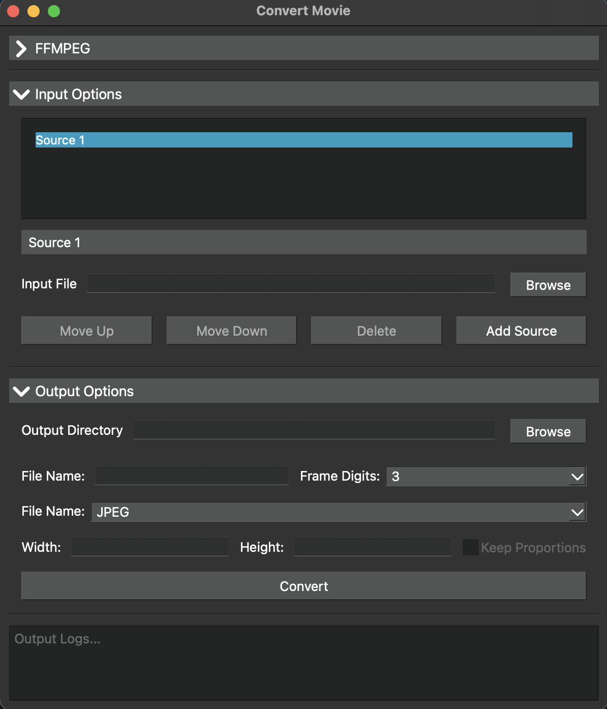

# MovieConvertStandalone
A verison fo the MovieConvert script for Maya that is now a standalone - needs FFMPEG to run.  
This application is built to run on Windows and MAC.  
  

## Install for Windows:
1. Download the packaged application for Windows [here](movieConvert-WINDOWS.zip).
2. Extract files
3. Double-click on **MovieConvert.exe**

## Install for MAC:
1. Download the packaged application for MAC [here](movieConvert-macOS.zip).
2. Extract files
3. Double-click on **MovieConvert.app**

## FFMPEG - latest version
1. Verify FFMPEG section is green in the app.
2. If not download the latest version of FFMPEG and select the FFMPEG executable in the app.
3. [FFMPEG Download](https://www.ffmpeg.org/)
